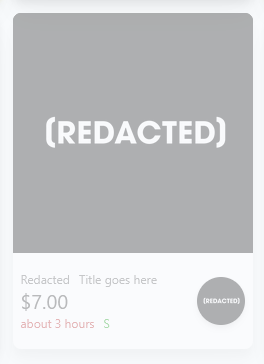
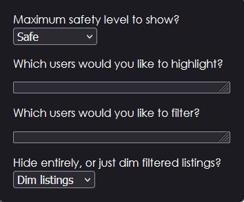

# Enhancement Kit for Commishes

A small extension with tools to enhance your Commishes experience.

## Features

* Dark mode implementation
    * Dark mode was already [mostly] programmed into the site, but now it's actually accessible!
    * Implementations for:
        * ych.commishes.com
        * ping.commishes.com
        * loot.commishes.com
* User highlighting in auction pages
    * Someone you particularly like? Want to keep track of their auctions from the main auction page? When set up, their listings will be highlighted with a colored border, making them easy to spot.
* User filtering in auction pages
    * Have some users that you aren't a fan of? Someone who only draws women? Someone whose art style you just don't gel with? Just add their name to the list of users, and you can either dim their listings or hide them entirely from the masonary.
* General QOL features
    * The "report listing" button is now present on mobile.
    * User filter and highlight buttons are available on both auctions and user pages.
    * Quick-switch between safety levels without going to your user settings.
    * Add Loot link to user pages.

## Images

